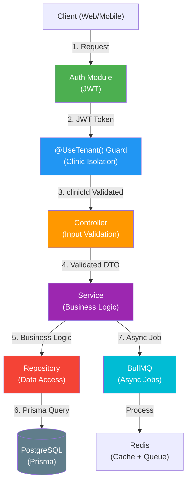

# ✅ Med-System Phase 0 Setup Complete

**Date:** 2026-06-25  
**Status:** Ready for Phase 1 (Auth Module Implementation)

---

## What Was Created

### 1. **Root Configuration** ✅
- `package.json` - Root monorepo workspace
- `tsconfig.json` - TypeScript configuration
- `docker-compose.yml` - PostgreSQL + Redis infrastructure
- `.gitignore` - Git configuration
- `.eslintrc.json` - ESLint rules
- `.prettierrc.json` - Prettier formatter config

### 2. **API Application** (`apps/api/`) ✅
#### Configuration Files
- `package.json` - Dependencies & scripts
- `tsconfig.json` - TypeScript config with path aliases
- `.env.example` - Environment template
- `.env` - Current development configuration

#### Project Structure (directories created)
```
apps/api/src/
├── common/
│   ├── decorators/      # Auth decorators (@UseTenant, @Authenticate)
│   ├── guards/          # Route guards (JWT, Tenant isolation)
│   ├── filters/         # Global exception handling
│   ├── middleware/      # Express middleware
│   ├── dto/             # Zod validation schemas
│   └── utils/           # Shared utilities
├── config/              # Environment validation
├── modules/             # 9 feature modules (empty, ready to populate)
│   ├── auth/
│   ├── clinic/
│   ├── users/
│   ├── appointments/
│   ├── reception/
│   ├── reminders/
│   ├── no-shows/
│   ├── crm/
│   ├── exams/
│   ├── financial/
│   ├── post-consultation/
│   ├── marketing/
│   └── ai-agent/
├── repositories/        # Data access layer (Prisma)
├── jobs/                # BullMQ async workers
│   ├── processors/
│   └── queues/
├── database/            # Prisma schema & migrations
├── routes/              # Express route definitions
├── types/               # TypeScript type definitions
└── server.ts            # Bootstrap file (placeholder)
```

### 3. **Database** ✅
- `prisma/schema.prisma` - Complete data model
  - ✅ Multi-tenant support (Clinic as root entity)
  - ✅ Users & Authentication (roles: ADMIN, DOCTOR, RECEPTIONIST, PATIENT)
  - ✅ Doctors, Patients, Appointments
  - ✅ Reminders, Exams, Invoices, Feedback
  - ✅ Audit logging (LGPD compliance)
  - ✅ Post-consultation feedback
  - ✅ Financial tracking

### 4. **Frontend Scaffold** (`apps/web/`) ✅
- Directory structure created (Next.js ready)
- Components, hooks, styles organized

### 5. **Shared Packages** ✅
- `packages/types/` - Shared TypeScript types
- `packages/logger/` - Logging utilities
- `packages/validation/` - Zod schemas

### 6. **Documentation** ✅
- `README.md` - Complete setup guide
- `CLAUDE.md` - Development guidelines
- `SETUP_COMPLETE.md` - This file

---

## What's Ready

### ✅ Infrastructure
- Docker Compose with PostgreSQL 16 + Redis 7
- Health checks configured
- Volume persistence for database

### ✅ TypeScript Setup
- Strict mode enabled
- Path aliases configured (`@/*`, `@modules/*`, etc.)
- `dist/` output directory ready

### ✅ Code Quality Tools
- ESLint configuration
- Prettier formatting rules
- Build & test scripts ready

### ✅ Database Schema
- 15 models defined
- Relationships configured
- Indexes optimized
- Migrations ready to run

---

## What's Next (Phase 1)

### Priority 1: Environment & Config
- [ ] Create `src/config/env.ts` with Zod validation
- [ ] Create `src/config/database.ts` for Prisma client
- [ ] Create `src/common/utils/logger.ts` for structured logging
- [ ] Validate all env vars on startup

### Priority 2: Auth Module
- [ ] Implement `src/modules/auth/auth.service.ts`
  - JWT generation & validation
  - Bcrypt password hashing
  - Login & register logic
- [ ] Create `src/common/guards/jwt.guard.ts`
- [ ] Create `POST /auth/login` endpoint
- [ ] Create `POST /auth/register` endpoint
- [ ] Test with Insomnia/Postman

### Priority 3: Clinic Management
- [ ] Create `src/modules/clinic/clinic.service.ts`
- [ ] Create `src/common/guards/tenant.guard.ts`
- [ ] Create `src/repositories/clinic.repo.ts`
- [ ] Implement multi-tenant isolation
- [ ] Create `POST /clinics` endpoint

### Priority 4: User Management
- [ ] Create `src/modules/users/users.service.ts`
- [ ] Implement role-based access control
- [ ] Create user CRUD endpoints
- [ ] Assign doctors, receptionists to clinics

### Priority 5: Bootstrap Express App
- [ ] Create `src/server.ts` with Express setup
- [ ] Add global error filter
- [ ] Add middleware (CORS, compression, logging)
- [ ] Add graceful shutdown

---

## How to Proceed

### Step 1: Verify Setup
```bash
# Install dependencies
npm install

# Generate Prisma client
npm run prisma:generate

# Start infrastructure
npm run docker:up

# Verify database connection (optional)
npm run prisma:studio
```

### Step 2: Create First Files
```bash
# Create config files
touch apps/api/src/config/env.ts
touch apps/api/src/config/database.ts
touch apps/api/src/common/utils/logger.ts

# Create auth module
touch apps/api/src/modules/auth/auth.service.ts
touch apps/api/src/modules/auth/auth.controller.ts
touch apps/api/src/modules/auth/auth.routes.ts
```

### Step 3: Implement Auth
Follow the pattern in `CLAUDE.md` → "Adding a New Feature" section

### Step 4: Test
```bash
npm run dev  # Start server (will fail until auth implemented)
npm run test # Run test suite
```

---

## Architecture Summary



---

## File Structure Reference

```
med-system/
├── .eslintrc.json          ✅ Linting rules
├── .prettierrc.json        ✅ Formatting rules
├── .gitignore              ✅ Git config
├── docker-compose.yml      ✅ Infrastructure
├── package.json            ✅ Root workspace
├── tsconfig.json           ✅ TS config
├── README.md               ✅ Setup guide
├── CLAUDE.md               ✅ Dev guide
├── SETUP_COMPLETE.md       ✅ This file
│
├── apps/
│   ├── api/                (ready for Phase 1)
│   │   ├── src/
│   │   │   ├── config/     (empty - create env.ts, database.ts)
│   │   │   ├── common/     (ready for guards, middleware, utils)
│   │   │   ├── modules/    (9 modules empty - populate Phase 1+)
│   │   │   ├── repositories/ (ready for data access layer)
│   │   │   ├── jobs/       (ready for async workers)
│   │   │   ├── database/   (schema.prisma ready)
│   │   │   ├── routes/     (ready for route definitions)
│   │   │   └── types/      (ready for types)
│   │   ├── prisma/
│   │   │   ├── schema.prisma ✅ Complete 15-model schema
│   │   │   └── migrations/   (empty - auto-generated)
│   │   ├── tests/          (ready for test suite)
│   │   ├── .env            ✅ Development config
│   │   ├── .env.example    ✅ Template
│   │   ├── package.json    ✅ Dependencies
│   │   └── tsconfig.json   ✅ TS config
│   │
│   └── web/                (Next.js scaffold ready)
│       ├── src/
│       │   ├── app/
│       │   ├── components/
│       │   ├── hooks/
│       │   ├── lib/
│       │   └── styles/
│       └── (package.json, tsconfig.json to be added)
│
├── packages/               (shared libraries scaffold)
│   ├── types/
│   ├── logger/
│   └── validation/
│
└── DEVELOPMENT PROGRESS
    Phase 0: ✅ COMPLETE - Setup & scaffolding
    Phase 1: 📋 TODO - Auth + Clinic management
    Phase 2: 📋 TODO - Appointments + scheduling
    Phase 3: 📋 TODO - Reminders + no-shows
    Phase 4: 📋 TODO - CRM + financial
    Phase 5: 📋 TODO - Exams + marketing + AI
```

---

## Important Notes

1. **Do NOT commit `.env` file** - Only `.env.example`
2. **Database URL in `.env`** - Must match docker-compose service name
3. **JWT_SECRET** - Must be at least 32 characters in production
4. **Prisma migrations** - Run `npm run prisma:migrate` before starting server
5. **Path aliases** - Always use `@modules/*` instead of `../../modules`

---

## Key Files to Understand

1. **`prisma/schema.prisma`** - Database design (read first!)
2. **`CLAUDE.md`** - Development patterns and conventions
3. **`package.json`** (root) - Workspace scripts
4. **`.env`** - Configuration (database, Redis, JWT secrets)

---

## Success Criteria for Phase 0

- [x] Monorepo structure created
- [x] TypeScript configured with strict mode
- [x] Docker infrastructure ready
- [x] Prisma schema complete with 15 models
- [x] ESLint & Prettier configured
- [x] Documentation complete
- [x] All directories created and organized
- [ ] **Next:** npm install & prisma:generate

---

## Ready to Start Phase 1?

Run this command to verify everything:
```bash
npm install && npm run prisma:generate
```

If no errors, you're ready to implement the Auth module! 🚀

---

**Status: Phase 0 ✅ COMPLETE**  
**Next Phase: Phase 1 (Auth Module)**  
**Estimated Phase 1 Duration: 4-6 hours**

For questions, see CLAUDE.md or README.md.

Good luck! 🎉
